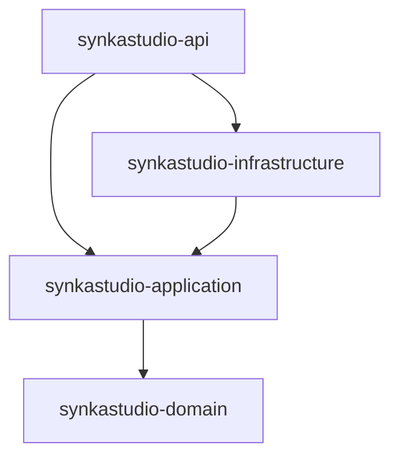

# 🚀 SynkaStudio

> **Backend de um Manufacturing Execution System (MES) multi-tenant para pequenas e médias indústrias de produção por lote.**

Desenvolvido com **Java 25 (LTS)** e **Spring Boot**, o SynkaStudio adota **Clean Architecture**, autenticação baseada em **JWT**, isolamento completo entre tenants e uma API REST como principal interface do sistema.

---

## ✨ Principais recursos

* 🏢 Arquitetura **Multi-Tenant**
* 🔐 Autenticação JWT + Spring Security
* 🧱 Clean Architecture
* 🗄️ PostgreSQL 16 + Flyway
* 🔒 Senhas protegidas com BCrypt
* 🧪 Testes unitários e de integração com Testcontainers
* 🐳 Ambiente totalmente containerizado com Docker

---

## 🏛️ Arquitetura

O projeto é dividido em quatro módulos Maven, seguindo os princípios da **Clean Architecture**, onde as dependências sempre apontam para o núcleo da aplicação.



### Módulos

| Módulo                         | Responsabilidade                                                                           |
| ------------------------------ | ------------------------------------------------------------------------------------------ |
| **synkastudio-domain**         | Entidades, regras de negócio, Result Pattern e invariantes. Sem dependências de framework. |
| **synkastudio-application**    | Casos de uso, serviços e portas (interfaces). Depende apenas do domínio.                   |
| **synkastudio-infrastructure** | Persistência, JPA/Hibernate, JWT, BCrypt, Multi-Tenancy, Flyway e adapters.                |
| **synkastudio-api**            | Controllers REST, configuração, segurança e bootstrap da aplicação.                        |

Mais detalhes podem ser encontrados em:

* `docs/ARCHITECTURE.md`
* `docs/DIAGRAMS.md`
* `docs/TRADE-OFFS.md`

---

## 🛠️ Tecnologias

* Java 25 (LTS)
* Spring Boot
* Maven
* Spring Data JPA
* Hibernate
* PostgreSQL 16
* Flyway
* Spring Security
* JWT (jjwt)
* BCrypt
* JUnit 5
* Testcontainers
* Docker & Docker Compose

---

## 🚀 Executando o projeto

### Pré-requisitos

* JDK 25
* Docker
* Docker Compose

O Maven Wrapper já acompanha o projeto, portanto não é necessário instalar o Maven.

### Banco de dados

```bash
docker compose up -d
```

### Executar testes

```bash
./mvnw verify
```

### Iniciar a aplicação

```bash
./mvnw -pl synkastudio-api spring-boot:run \
-Dspring-boot.run.profiles=dev
```

A API ficará disponível em:

```
http://localhost:8080
```

---

## 🐳 Executando tudo com Docker

Para subir API e PostgreSQL utilizando a imagem de produção:

```bash
docker compose --profile full up -d --build
```

Serviços disponíveis:

| Serviço    | Porta |
| ---------- | ----: |
| API REST   |  8080 |
| PostgreSQL |  5433 |

---

## 🔑 Usuário de desenvolvimento

Ao iniciar em **profile dev**, o projeto cria automaticamente um tenant e um usuário de testes.

| Campo  | Valor             |
| ------ | ----------------- |
| Tenant | `dev`             |
| Email  | `klaus@synka.dev` |
| Senha  | `SenhaDev123`     |

### Login

```bash
curl -X POST http://localhost:8080/api/v1/auth/login \
-H "Content-Type: application/json" \
-d '{
  "tenantCode":"dev",
  "email":"klaus@synka.dev",
  "password":"SenhaDev123"
}'
```

Utilize o token retornado no cabeçalho:

```
Authorization: Bearer <token>
```

---

## 🧪 Testes

O comando

```bash
./mvnw verify
```

executa:

* ✅ 44 testes unitários
* ✅ 3 testes de integração
* ✅ PostgreSQL descartável via Testcontainers
* ✅ Validação do isolamento entre tenants

---

## ❤️ Filosofia do projeto

O SynkaStudio foi desenvolvido priorizando:

* código limpo;
* baixo acoplamento;
* separação clara de responsabilidades;
* facilidade de manutenção;
* escalabilidade;
* segurança por padrão (*Secure by Default*).

---

## 📄 Licença

Este projeto está disponível sob a licença definida neste repositório.
